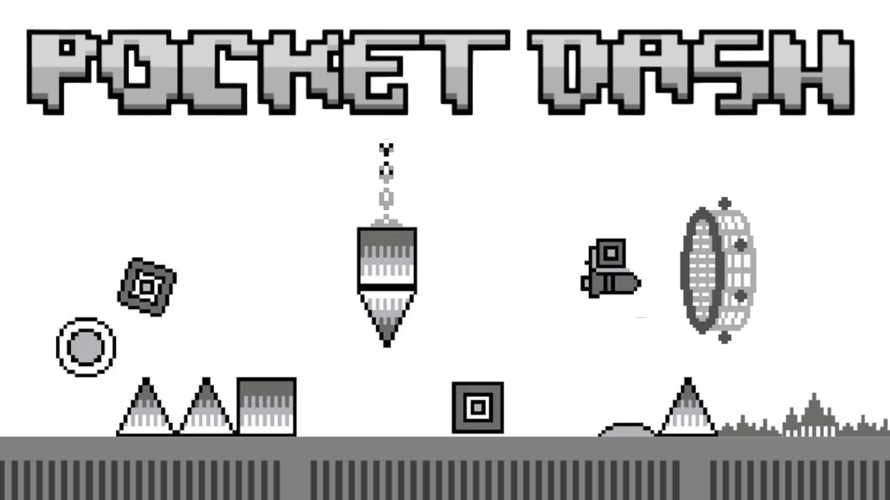
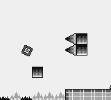
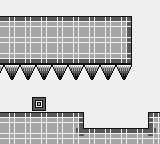
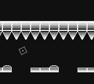
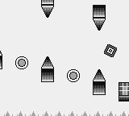
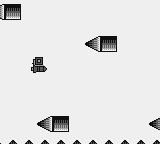

<p align="center">
  
</p>

# Pocket Dash

### Pocket Dash (or Geometry Dash Pocket/GDP) is a demake of Geometry Dash for the DMG and GBC Game Boy!
Info: The project was renamed to Geometry Dash Pocket, and was formerly known as GB DASH

### Images:
<p align="center">
  
  
</p>

<p align="center">
  
  
</p>

<p align="center">
  
</p>

---
# About
Experience the ultimate rage-inducing rhythm platformer, scaled down to 4 shades of green (or gray) and a crisp 160x144 resolution! Built from scratch for original Game Boy hardware.

Unlike GB Dash by TiTi, this one features a Famidash-style gameplay with the actual original levels, and support for the original (DMG) Game Boy!

This game is being actively developed (coding and music) by Sotospro24 and ElAngel378

# Features (as of now)
- All levels up to Cycles
- Gameplay (Cube, Ship, Ball)
- Accurate Physics
- Collision (Death and block collision)
- Music Covers
- All 1.0 - 1.2 mechanics including inverted gravity, mirror mode
- Level End screen
- Game Boy Original and Color support

---

# Download 
### Download the latest Nightly build here (Sotos24's branch): <a href="https://github.com/ElAngel378/GBDASH/releases/download/nightly/POCKETDASH.gb"><ins>DOWNLOAD</ins></a>
**WARNING!** These are constantly changing and might be broken.
### Alternatively, download the latest stable build in the releases tab.
---

# Building from source

Requires **GBDK-2020** (`gbdk-2020` v4.2.x or newer) and GNU Make.

- **Windows:** download the latest [GBDK releases](https://github.com/gbdk-2020/gbdk-2020/releases), unzip it, and point the build at it. The default search path is `C:/gbdk`; override it with the `GBDK` variable (e.g. `make GBDK=C:/dev/gbdk-2020`).
- **Linux/macOS** (and GitHub Actions): fetch and extract the `gbdk-linux64` release from the [GBDK releases](https://github.com/gbdk-2020/gbdk-2020/releases), then run `make` with `GBDK=/path/to/gbdk` exported.

Build the ROM:

```
make clean
make -j8
```

The output is `bin/POCKETDASH.gb`. Music playback uses [hUGEDriver](https://github.com/SuperDisk/hUGEDriver); its prebuilt `lib/hUGEDriver.lib` is included in this repository.

# Development Info

| Contributor | Contribution |
|---|---|
|[**Sotos_24**](https://github.com/Soteris24) **and** [**ElAngel378**](https://github.com/ElAngel378)|**Project creators and lead developers**|
|[Sotos_24](https://github.com/Soteris24) | Code (main code), Music, Graphics <sub>*when I feel like it*</sub> |
|[ElAngel378](https://github.com/ElAngel378) |Code (optimize), Music, Graphics|
|[Crafty Jumper](https://github.com/Crafty-Jumper) | Music, Graphics |
|[Ziqiangao](https://github.com/ziqiangao/)| Tools, Music, Graphics|
|PBaxx | Graphics |
|Finntendo | Graphics |
|Switchroot | Graphics |
|BobAJoeJoe | Graphics, Music |
|Ranedom | Graphics |
|NerdBoy628 | Music |


---

# TODO (for 1.0 release)
- Add all objects, mechanics, levels up to 1.3
- A proper menu and level select
- Decoration (supported only in GBC mode)
- Graphical improvements

---

# Contributing 

**Ways of Contributing**
1. Join the [Discord](https://discord.gg/cg8NRGxJTv)
2. Pull Requests
3. Contacting the main devs
4. Do NOT open issues for a discussion.
5. Any issues can be reported in the issues tab.

# Thank you
### To <a href="https://github.com/tfdsoft/famidash"><ins>TFDSoft</ins></a> , the Famidash team for assets (such as level files, graphics)
### And, of course, the game we all love: Geometry Dash by RobTop Games.
